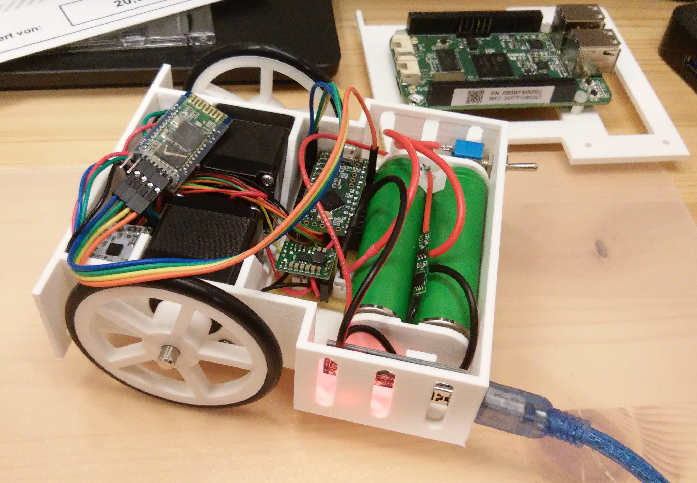

# StepperBotChassis

This is the chassis of two wheeled rover with stepper motors for precision movement. It is part of a larger project. The whole rover is "layered" in three slices:
- the chassis layer
- the control layer with a beagleblone green wireless as the brain
- the sensor layer

  

